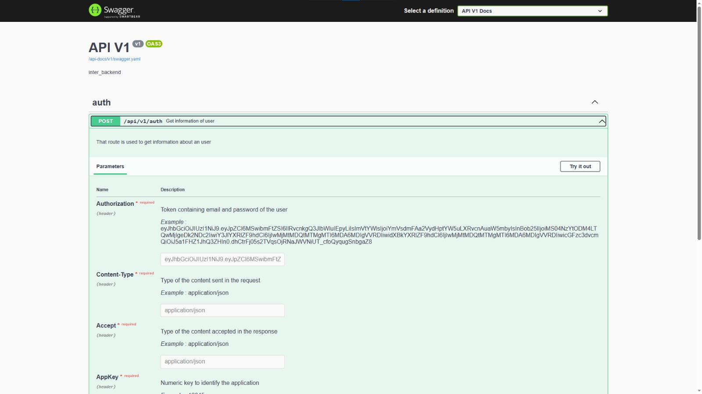

# Inter_Backend
Este projeto consiste na realização de um sistema de gerenciamento de doações e integrações entre ONGs, Empresas e doadores.
O sistema foi desenvolvido utilizando a linguagem Ruby, com o framework Ruby On Rails, com o banco de dados MySLQ.
O sistema é referente a uma API REST, que será consumida por um aplicativo mobile, que será desenvolvido em React Native.
O projeto foi desenvolvido para todas as disciplinas do 5º período do curso de Análise e Desenvolvimento de Sistemas da Universidade IBGM.

## Pré-requisitos
- Docker
- Docker Compose

## Instalação
- Clone o repositório para sua máquina local
- Navegue até a pasta do projeto
- Execute o comando docker-compose up para iniciar os contêineres
- Acesse o servidor web do Rails em http://localhost:3000

## Uso
- Para o "consumo" do serviço, você pode acessar a documentação da API em http://localhost:3000/api-docs.

- Para executar os testes do projeto, execute o seguinte comando na raiz do projeto: docker-compose run web bundle exec rspec

## Contribuição
A contribuição é feita através dos alunos do curso de Análise e Desenvolvimento de Sistemas da Universidade IBGM.
Após a conclusão do projeto, o código será disponibilizado para a comunidade, visando uma abertura nos pull requests e solicitações
de alterações.

## Licença
NONE
